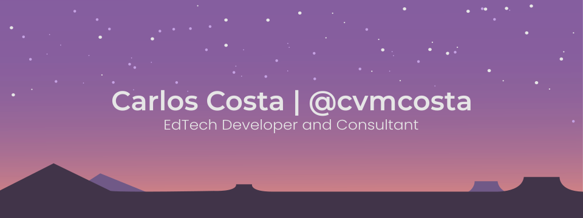

<!-- Greeting -->

<!--Introduction -->
<h4 style="margin: 0px; margin-bottom: 0px"> > Hello! 👋 I'm CVM!</h4>
<h4 style="margin: 0px; margin-bottom: 0px"> > I like working on Open Source and EdTech projects ❤️</h4>
<h4 style="margin: 0px; margin-bottom: 0px"> > I work as a Consultant for LTI integrations 💻</h4>

## 🌟 Featured projects

	<a href="https://ltiaas.com"></img></a>
   
   

> A ready-to-go SaaS LTI solution.

If you need an enterprise-ready LTI deployment, LTIaaS can get you up and running in a matter of minutes. We offer a SaaS solution with a powerful, easy to use, API that gives you access to the entire functionality of the LTI protocol. And you only start paying once your product starts to grow.

Through our consultation services we can help you design, build and maintain your LTI tool. The LTIaaS API is already being used to reach thousands of students across the entire world!

> For more information visit [LTIaaS.com](https://ltiaas.com)
> - [API Documentation](https://ltiaas.com/docs/)
> - [Pricing information and simulator](https://ltiaas.com/pricing/)
> - [Contact us](https://ltiaas.com/contact-us/)

---

  

> Ltijs

- [NodeJS Library for the LTI 1.3 Protocol](https://cvmcosta.github.io/ltijs)
- [Certified by IMS](https://site.imsglobal.org/certifications/coursekey/ltijs)
- [Support for the  LTI Advantage Dynamic Registration Service](https://cvmcosta.me/ltijs/#/dynamicregistration)

---

  

> Moodle as a LTI 1.3 Provider

- Enrolment Plugin that allows Moodle to work as a LTI 1.3 Provider
- [Works by linking Moodle to an instance of Ltiaas](https://ltiaas.cvmcosta.com)
- Allows Moodle to serve Resources through Deep Linking

## 📫 Where to find me

<a href="mailto:cvmcosta@ltiaas.com">
    

  
<a href="https://twitter.com/cvmcosta">
  

<a href="https://www.linkedin.com/in/carlos-vin%C3%ADcius-761666145/">
    

---

